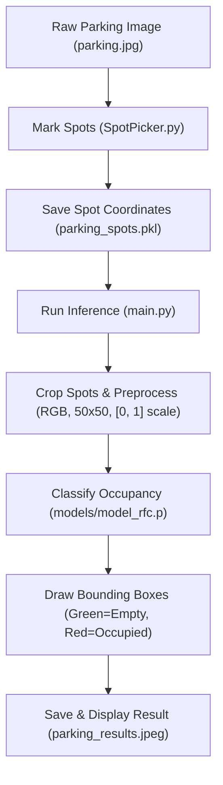

# 🚗 ParkVision: Smart Parking Space Classifier

[](https://www.python.org/)
[](https://scikit-learn.org/)
[](https://opencv.org/)

An advanced, high-performance computer vision pipeline designed to automate parking space occupancy detection. **ParkVision** processes cropped parking spot images to classify them as either **Empty** (`0`) or **Occupied/Not Empty** (`1`) using a Random Forest Classifier.

---

## 📊 Classification Results Visualization

When running the inference pipeline, the Random Forest model analyzes every cropped bounding box defined in [SpotPicker.py](file:///Users/wess/Desktop/computer%20vision/Smart_Parking_Space_CV/SpotPicker.py) and classifies its occupancy status:

- **🟢 Green Boxes**: Spots classified as **Empty** (`0`).
- **🔴 Red Boxes**: Spots classified as **Occupied** (`1`).

Here is the resulting output saved at `parking_results.jpeg`:


---

## 🏗️ Architecture & Flow Scheme



---

## 📂 Directory Structure

```text
Smart_Parking_Space_CV/
├── .venv/                      # Python virtual environment (ignored)
├── data/                       # Initial training/testing slot patches
│   ├── empty/                  # Cropped patches of empty parking slots
│   └── not_empty/              # Cropped patches of occupied parking slots
├── data_2/                     # Multi-domain evaluation dataset
├── models/                     # Saved model checkpoints
│   ├── model_rfc.p             # Trained Random Forest model (50x50 RGB inputs)
│   └── model_svm.p             # Trained Support Vector Machine model
├── SpotPicker.py               # Interactive script to mark parking spot coordinates
├── utils.py                    # Mouse callback logic used by SpotPicker
├── main.py                     # Execution pipeline predicting occupancy in real-time
├── model.ipynb                 # Classifier training, validation, and serialization
├── requirements.txt            # Project dependencies list
└── parking_results.jpeg        # Output annotated image showing spot status
```

---

## 📄 File Details

Below is a breakdown of the core components within the repository:

- [SpotPicker.py](file:///Users/wess/Desktop/computer%20vision/Smart_Parking_Space_CV/SpotPicker.py): The interactive GUI tool to define bounding boxes of the parking spaces. Left-click to add a spot, right-click to remove. The spot coordinates are serialized to `parking_spots.pkl`.
- [utils.py](file:///Users/wess/Desktop/computer%20vision/Smart_Parking_Space_CV/utils.py): Mouse callback helper functions mapping left and right clicks to coordinate manipulations.
- [main.py](file:///Users/wess/Desktop/computer%20vision/Smart_Parking_Space_CV/main.py): Loads the saved spot coordinates and Random Forest model, processes the current image frame, runs predictions on each crop, and renders the result window.
- [model.ipynb](file:///Users/wess/Desktop/computer%20vision/Smart_Parking_Space_CV/model.ipynb): Jupyter Notebook showing data loading, preprocessing, model training (SVM, XGBoost, Random Forest), split optimization to avoid spatial data leakage, and pickle serialization.

---

## 🧮 How It Works (Core Preprocessing Logic)

During training in [model.ipynb](file:///Users/wess/Desktop/computer%20vision/Smart_Parking_Space_CV/model.ipynb), images were loaded via `skimage` (RGB) and scaled to `[0, 1]` during resizing. To prevent wrong classifications during inference in [main.py](file:///Users/wess/Desktop/computer%20vision/Smart_Parking_Space_CV/main.py), crops are preprocessed identically:

```python
# 1. Convert BGR (OpenCV default) to RGB (Skimage standard)
img_rgb = cv2.cvtColor(spot_crop, cv2.COLOR_BGR2RGB)

# 2. Resize to 50x50 pixels
img_resized = cv2.resize(img_rgb, (50, 50))

# 3. Normalize intensity values to [0, 1]
img_normalized = img_resized / 255.0

# 4. Flatten and reshape to a 1D vector (1, 7500)
img_flat = img_normalized.flatten().reshape(1, -1)
```

---

## 🛠️ Setup & Requirements

### Prerequisites

Make sure you have **Python 3.8 or higher** installed.

### Step 1: Create and Activate a Virtual Environment

```bash
python3 -m venv .venv
source .venv/bin/activate
```

### Step 2: Install Dependencies

```bash
pip install -r requirements.txt
```

---

## 🎮 Usage Controls

### 1. Defining Parking Spots

Run the spot picker tool:

```bash
python SpotPicker.py
```

- **Left-Click**: Add a new parking spot bounding box.

* **Right-Click**: Delete a bounding box.
- **q / Space / ESC**: Save coordinates and exit.

### 2. Running Real-Time Detection

Run the main script to perform inference on the selected spaces and output the color-coded visual results:

```bash
python main.py
```
