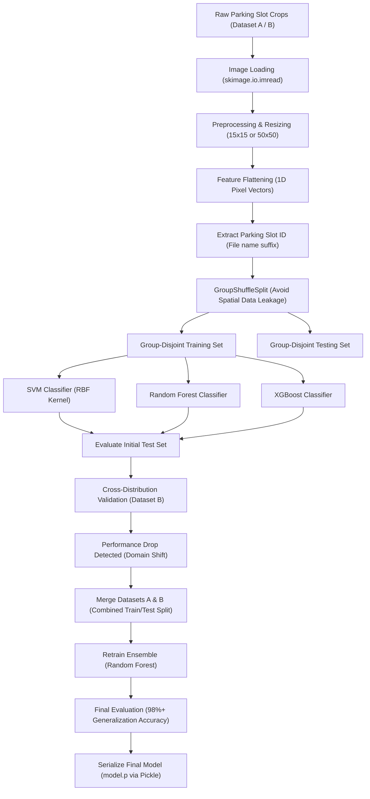

# 🚗 ParkVision: Smart Parking Space Classifier

[](https://www.python.org/)
[](https://scikit-learn.org/)
[](https://xgboost.readthedocs.io/)
[](https://opencv.org/)

An advanced, high-performance computer vision pipeline designed to automate parking space occupancy detection. **ParkVision** processes cropped parking spot images to classify them as either **Empty** (`0`) or **Occupied/Not Empty** (`1`). By utilizing robust machine learning classifiers (SVM, Random Forest, XGBoost) and addressing critical spatial data leakage, ParkVision delivers highly reliable predictions across varying environmental conditions and camera angles.

---

## 🏗️ Architecture & Flow Scheme

The diagram below outlines the technical workflow from raw image inputs to classification results, model evaluation, and serialization:



---

## 📂 Directory Structure

Here is a visual tree representation of the workspace:

```text
Smart_Parking_Space_CV/
├── .venv/                      # Python virtual environment (ignored)
├── data/                       # Initial training/testing slot patches
│   ├── empty/                  # Cropped patches of empty parking slots
│   └── not_empty/              # Cropped patches of occupied parking slots
├── data_2/                     # Multi-domain evaluation dataset
│   ├── A/                      # Camera View A (busy/free)
│   └── B/                      # Camera View B (busy/free)
├── models/                     # Saved model artifacts / checkpoints
├── main.ipynb                  # Experimental analysis & evaluation notebook
├── main.py                     # CLI pipeline script for model training
├── utils.py                    # Helper and utility functions
├── requirements.txt            # Project dependencies list
└── model.p                     # Serialized production model (Pickled SVM)
```

---

## 📄 File Details

Below is a breakdown of the core components within the repository:

*   [main.py](file:///Users/wess/Desktop/computer%20vision/Smart_Parking_Space_CV/main.py): The primary execution script. It loads images from the standard `data/` directory, extracts slot-specific group labels, performs a group-disjoint split, trains SVM, XGBoost, and Random Forest models, prints detailed classification reports, and saves the trained SVC model to disk.
*   [main.ipynb](file:///Users/wess/Desktop/computer%20vision/Smart_Parking_Space_CV/main.ipynb): Interactive Jupyter Notebook containing exploratory data analysis, hyperparameter tuning (`GridSearchCV`), and domain generalization experiments. It walks through predicting on Out-of-Distribution (OOD) sets (`data_2/A` and `data_2/B`), illustrates model performance degradation due to distribution shift, and demonstrates the resolution via training set expansion.
*   [utils.py](file:///Users/wess/Desktop/computer%20vision/Smart_Parking_Space_CV/utils.py): Dedicated file reserved for utility functions, such as custom plotting, coordinate mapping, or video patch extraction.
*   [requirements.txt](file:///Users/wess/Desktop/computer%20vision/Smart_Parking_Space_CV/requirements.txt): Configuration listing all mandatory third-party Python packages required to build, run, and experiment with the classification pipeline.
*   [model.p](file:///Users/wess/Desktop/computer%20vision/Smart_Parking_Space_CV/model.p): Pickled serialization of the high-accuracy Support Vector Classifier (SVC) tuned with optimal parameters (`C=10`, `gamma=0.01`).

---

## 🧮 How It Works (Core Logic)

### 1. Spatial Data Leakage Prevention
In parking space datasets, multiple frames of the exact same parking slot are captured over time (different hours, lighting conditions, or weather). Standard randomized splits (`train_test_split`) lead to severe spatial data leakage, where patches of Slot #12 appear in both training and test sets. This results in artificially high test metrics (overfitting) that fail to generalize to new parking slots.

ParkVision solves this by extracting the unique spot identifier from the image filenames:
$$\text{Filename: } \text{patch\_15.jpg} \implies \text{Group ID: } 15$$
We then apply `GroupShuffleSplit` to ensure that a parking slot's patches are **exclusively** allocated to either the training set or the test set:
```python
gss = GroupShuffleSplit(n_splits=1, test_size=0.2, random_state=42)
train_idx, test_idx = next(gss.split(data, labels, groups))
```

### 2. Preprocessing & Feature Extraction
*   **Reading & Resizing:** Crop patches of parking slots are loaded and normalized. Resizing to a uniform size (e.g., $15 \times 15$ or $50 \times 50$ pixels) reduces dimensionality and makes training resource-friendly.
*   **Vectorization:** Resized RGB images are flattened into a 1D feature vector:
$$\mathbf{x}_i \in \mathbb{R}^{d} \quad \text{where } d = W \times H \times C$$
For a $15 \times 15$ RGB patch, $d = 15 \times 15 \times 3 = 675$ features.

### 3. Classification Algorithms
*   **Support Vector Machine (SVM):** Constructs a maximum-margin hyperplane in a high-dimensional kernel space (RBF kernel) to split empty/occupied spaces:
$$\min_{\mathbf{w}, b, \boldsymbol{\xi}} \frac{1}{2} \|\mathbf{w}\|^2 + C \sum_{i=1}^n \xi_i$$
*   **XGBoost:** Trains an ensemble of gradient-boosted decision trees sequentially to minimize log-loss objective functions.
*   **Random Forest:** Combines predictions from multiple random decision trees using bagging (bootstrap aggregating) to prevent overfitting.

---

## 🛠️ Setup & Requirements

Follow these instructions to set up the project on your local machine:

### Prerequisites
Make sure you have **Python 3.8 or higher** installed.

### Step 1: Clone or Navigate to the Workspace
Open your terminal and navigate to the project directory:
```bash
cd "/Users/wess/Desktop/computer vision/Smart_Parking_Space_CV"
```

### Step 2: Create a Virtual Environment
Create an isolated virtual environment to manage dependencies:
```bash
python3 -m venv .venv
```

### Step 3: Activate the Virtual Environment
*   **macOS / Linux:**
    ```bash
    source .venv/bin/activate
    ```
*   **Windows (Command Prompt):**
    ```cmd
    .venv\Scripts\activate.bat
    ```

### Step 4: Install Dependencies
Install all required libraries using `pip`:
```bash
pip install --upgrade pip
pip install -r requirements.txt
```

---

## 🎮 Controls / Usage

### Running the Python Pipeline
To run the standard training pipeline, evaluate performance, and generate the pickled classifier:
```bash
python main.py
```

### Running the Jupyter Notebook
For interactive experiments, prediction visualizations, and domain generalization checks:
```bash
jupyter notebook main.ipynb
```
*(Or open the notebook in VS Code / PyCharm with the `.venv` kernel selected).*

### Utilizing the Pickled Model
You can load and use the trained SVM model in your custom scripts:
```python
import pickle
import numpy as np
from skimage.io import imread
from skimage.transform import resize

# 1. Load the pre-trained SVM model
model = pickle.load(open("model.p", "rb"))

# 2. Preprocess custom cropped space patch
img = imread("path_to_crop.jpg")
img_resized = resize(img, (15, 15)).flatten().reshape(1, -1)

# 3. Predict occupancy
prediction = model.predict(img_resized)[0]
status = "Occupied" if prediction == 1 else "Empty"
print(f"Parking Spot Status: {status}")
```
