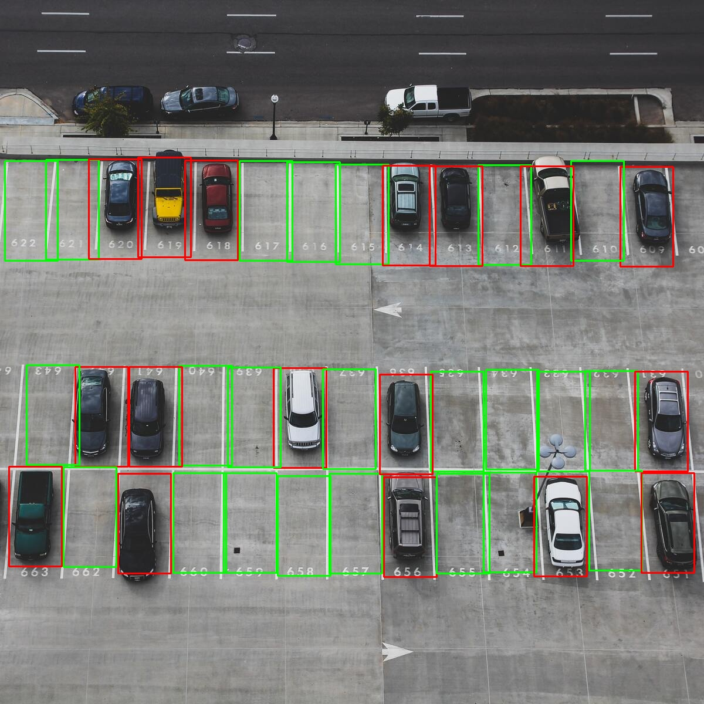
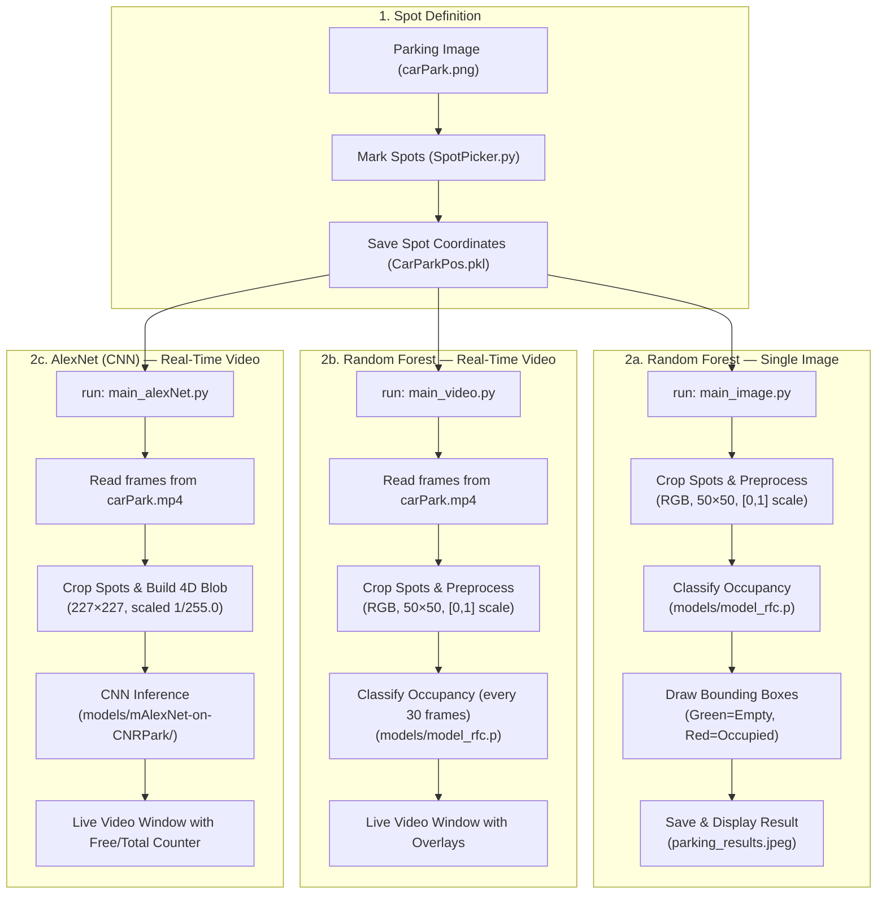

# 🚗 ParkVision: Smart Parking Space Classifier

[](https://www.python.org/)
[](https://scikit-learn.org/)
[](https://opencv.org/)
[](https://caffe.berkeleyvision.org/)

An advanced, high-performance computer vision pipeline designed to automate parking space occupancy detection. **ParkVision** processes cropped parking spot images to classify them as either **Empty** or **Occupied** using multiple approaches:

- **`main_image.py`** — Random Forest classifier on a single image (outputs `parking_results.jpeg`)
- **`main_video.py`** — Random Forest classifier on real-time video (`carPark.mp4`)
- **`main_alexNet.py`** — Caffe AlexNet (CNN) on real-time video (`carPark.mp4`)

---

## 📊 Classification Results Visualization

When running the inference pipeline, the selected model analyzes every cropped bounding box defined in [SpotPicker.py](SpotPicker.py) and classifies its occupancy status:

- **🟢 Green Boxes**: Spots classified as **Empty**.
- **🔴 Red Boxes**: Spots classified as **Occupied**.

Here is an example output saved at `parking_results.jpeg`:



---

## 🏗️ Architecture & Flow Scheme

The project supports three independent inference pipelines:



---

## 📂 Directory Structure

```text
Smart_Parking_Space_CV/
├── .venv/                          # Python virtual environment (ignored)
├── data/                           # Initial training/testing slot patches
│   ├── empty/                      # Cropped patches of empty parking slots
│   └── not_empty/                  # Cropped patches of occupied parking slots
├── data_2/                         # Multi-domain evaluation dataset
├── models/                         # Saved model checkpoints
│   ├── model_rfc.p                 # Trained Random Forest model (50×50 RGB inputs)
│   ├── model_svm.p                 # Trained Support Vector Machine model
│   └── mAlexNet-on-CNRPark/        # Caffe AlexNet model files (deploy.prototxt + .caffemodel)
├── SpotPicker.py                   # Interactive GUI to mark parking spot coordinates
├── utils.py                        # Mouse callback + FPS utilities used by SpotPicker and main scripts
├── main_image.py                   # Single-image inference pipeline (Random Forest → parking_results.jpeg)
├── main_video.py                   # Real-time video inference pipeline (Random Forest)
├── main_alexNet.py                 # Real-time video inference pipeline (Caffe AlexNet CNN)
├── model.ipynb                     # Classifier training, validation, and serialization
├── requirements.txt                # Project dependencies list
├── CarParkPos.pkl                  # Serialized parking spot coordinates (set by SpotPicker)
├── carPark.png                     # Source image for marking spots
├── carPark.mp4                     # Sample video for real-time detection
└── parking_results.jpeg            # Output annotated image showing spot status
```

---

## 📄 File Details

Below is a breakdown of the core components within the repository:

| File | Description |
|------|-------------|
| [SpotPicker.py](SpotPicker.py) | Interactive GUI tool to define bounding boxes of parking spaces. **Left-click** to add a spot, **right-click** to remove. Coordinates are serialized to `CarParkPos.pkl`. Box dimensions: 107×48 px. |
| [utils.py](utils.py) | Mouse callback helpers (`mouse_click`) for coordinate manipulation, plus FPS calculation and display utilities (`get_fps`, `draw_fps_capsule`). |
| [main_image.py](main_image.py) | Loads saved spot coordinates + Random Forest model, processes a single image frame, runs predictions on each crop, and saves the annotated result to `parking_results.jpeg`. |
| [main_video.py](main_video.py) | Loads saved spot coordinates + Random Forest model, processes a video stream frame-by-frame, batches predictions every 30 frames, and renders the live result window. |
| [main_alexNet.py](main_alexNet.py) | Loads saved spot coordinates + Caffe AlexNet model, processes a video stream, runs CNN inference per frame (227×227 blob), and renders a live result window with a Free/Total counter dashboard. |
| [model.ipynb](model.ipynb) | Jupyter Notebook showing data loading, preprocessing, model training (SVM, XGBoost, Random Forest), split optimization to avoid spatial data leakage, and pickle serialization. |

---

## 🧮 Preprocessing Logic

Each inference script must preprocess crops identically to how they were prepared during training.

### Random Forest Models (`main_image.py` & `main_video.py`)

```python
# 1. Convert BGR (OpenCV default) to RGB (skimage standard)
img_rgb = cv2.cvtColor(spot_crop, cv2.COLOR_BGR2RGB)

# 2. Resize to 50×50 pixels
img_resized = cv2.resize(img_rgb, (50, 50))

# 3. Normalize intensity values to [0, 1]
img_normalized = img_resized / 255.0

# 4. Flatten to a 1D vector (1, 7500)
img_flat = img_normalized.flatten().reshape(1, -1)
```

### Caffe AlexNet Model (`main_alexNet.py`)

```python
# 1. Build a 4D Caffe blob from the raw crop (227×227, scale 1/255.0)
blob = cv2.dnn.blobFromImage(
    spot_crop,
    scalefactor=1.0 / 255.0,
    size=(227, 227),
    mean=(0.0, 0.0, 0.0),
    swapRB=False,
)

# 2. Run forward pass through the network
net.setInput(blob)
output = net.forward()

# 3. Argmax over class scores: 0 = Empty, 1 = Occupied
prediction = np.argmax(output[0])
```

---

## 🛠️ Setup & Requirements

### Prerequisites

Make sure you have **Python 3.8 or higher** installed.

### Step 1: Create and Activate a Virtual Environment

```bash
python3 -m venv .venv
source .venv/bin/activate
```

### Step 2: Install Dependencies

```bash
pip install -r requirements.txt
```

---

## 🎮 Usage Controls

### 1. Defining Parking Spots

Run the spot picker tool to manually mark parking spaces on the reference image:

```bash
python SpotPicker.py
```

- **Left-Click**: Add a new parking spot bounding box (107×48 px).
- **Right-Click**: Delete an existing bounding box (click inside the box).
- **q / Space / ESC**: Save coordinates and exit.

Spots are automatically saved to `CarParkPos.pkl` on every click.

### 2. Single-Image Inference (Random Forest)

Classify parking spots on a static image and save the annotated result:

```bash
python main_image.py
```

- Reads spot coordinates from `parking_spots.pkl` and the image from `parking.jpg`.
- Saves the colour-coded result to `parking_results.jpeg`.

### 3. Real-Time Video Inference (Random Forest)

Run the Random Forest model on a live video stream (`carPark.mp4`):

```bash
python main_video.py
```

- Predictions are batched every 30 frames for performance.
- Press **Space** to exit the video window.

### 4. Real-Time Video Inference (Caffe AlexNet CNN)

Run the deep learning AlexNet model on a live video stream (`carPark.mp4`):

```bash
python main_alexNet.py
```

- Processes every frame with a 227×227 blob through the Caffe model.
- Displays a **Free / Total** counter dashboard in the top-left corner.
- Press **Space** or **q** to exit the video window.

---

## 🧪 Model Training

Open the Jupyter Notebook to train, validate, and export the classifiers:

```bash
jupyter notebook model.ipynb
```

The notebook covers:
- Dataset loading from `data/empty/` and `data/not_empty/`
- Preprocessing (resize to 50×50, normalize to [0, 1])
- Comparing SVM, XGBoost, and Random Forest classifiers
- Avoiding spatial data leakage during train/test splits
- Serializing the best model to `models/model_rfc.p`

---

## 🖼️ Visual Output Legend

| Colour | Meaning |
|--------|---------|
| 🟢 Green box | **Empty** parking spot |
| 🔴 Red box | **Occupied** parking spot |